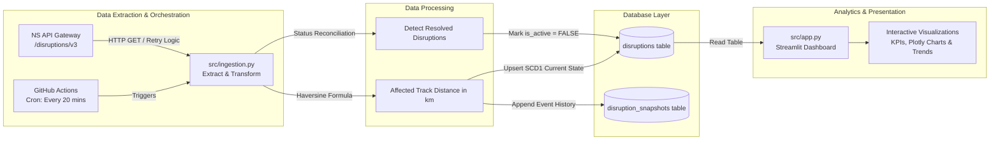

# 🇳🇱 NS Train Disruptions Data Pipeline & Live Dashboard

[](https://share.streamlit.io)
[](https://www.python.org/downloads/)
[](https://supabase.com/)
[](https://github.com/features/actions)

An end-to-end data engineering and analytics project that automatically ingests real-time train disruption data across the Netherlands via the **NS (Nederlandse Spoorwegen) API**, processes geospatial and operational metrics, stores them in a **Supabase PostgreSQL** database, and visualizes live trends using an interactive **Streamlit** dashboard.

---

## 🏗️ Architecture & Data Flow



---

## ⚙️ Key Engineering Features

- **Automated Cloud Orchestration**: GitHub Actions cron runs the ETL workflow automatically every 20 minutes (`7,27,47 * * * *`).
- **Resilient API Ingestion**: Built with `requests.Session` and `urllib3.util.retry.Retry` to handle transient network errors, rate-limiting (`429`), and server timeouts with exponential backoff.
- **Geospatial Distance Calculation**: Computes the physical track length (in kilometers) affected by each incident using the **Haversine formula** across consecutive station coordinates (`lat`, `lng`).
- **State Reconciliation**: Automatically tracks when disruptions finish by comparing the live feed with the database, updating active records to `is_active = FALSE`.
- **Dual Table Schema Strategy**:
  - `disruptions`: Stores the single current state of every incident (`ON CONFLICT (id) DO UPDATE`).
  - `disruption_snapshots`: Point-in-time event log for historical progression analysis.

---

## 🛠️ Tech Stack

- **Language & Pipeline**: Python 3.11, `psycopg2`, `requests`, `urllib3`
- **Database**: Supabase (Cloud PostgreSQL)
- **CI/CD & Orchestration**: GitHub Actions
- **Dashboard & Analytics**: Streamlit, Plotly, Pandas

---

## 📊 Dashboard Features

- **Real-Time KPIs**: Total disruptions, average duration, active incidents count, and cumulative weighted impact (`duration × affected_km`).
- **Interactive Time Series Trends**: Bar chart switchable between **Monthly** and **Weekly** views using custom Plotly interactive controls.
- **Root Cause & Disruption Type Breakdown**: Donut chart and horizontal ranking charts highlighting frequent causes (e.g., maintenance, weather, signal faults).
- **Live Search & Filter**: Filter by Year, Month, and Disruption Type, with an expandable raw record viewer.

---

## 💻 Local Development Setup

If you want to run this project locally on your machine:

### 1. Clone the repository
```bash
git clone https://github.com/sea-bug0310/ns-disruption-dashboard.git
cd ns-disruption-dashboard
```

### 2. Install dependencies
```bash
pip install -r requirements.txt
```

### 3. Configure Secrets
Create a `.env` file in the root directory for ingestion:
```env
DATABASE_URL=postgresql://<user>:<password>@<host>:<port>/postgres
NS_API_KEY=your_ns_api_portal_key
```

Create `.streamlit/secrets.toml` for the dashboard:
```toml
SUPABASE_URL = "https://your-project.supabase.co"
SUPABASE_KEY = "your-supabase-anon-key"
```

### 4. Run the Pipeline & App
```bash
# Run ingestion manually
python src/ingestion.py

# Launch the Streamlit dashboard
streamlit run src/app.py
```